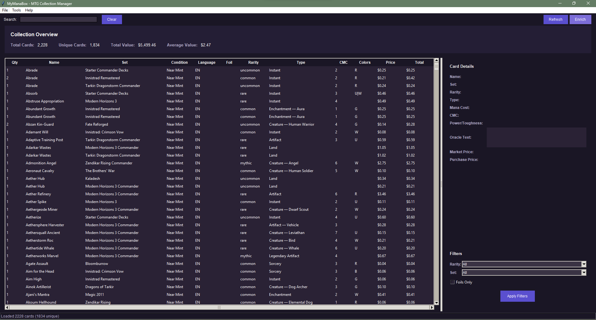

# MyManaBox - Magic: The Gathering Collection Manager

A comprehensive Python tool for managing and organizing Magic: The Gathering card collections with advanced pricing analytics and modern GUI.


*Modern GUI interface showing collection overview, card table with pricing data, and detailed card information panels*

## Features

- **Collection Management**: Import and manage MTG card collections from various sources
- **Advanced Pricing**: Market-accurate pricing with TCGPlayer-style logic and aggressive premium multipliers
- **Smart Analytics**: Comprehensive average pricing analysis by rarity, set, condition, and price tiers
- **Modern GUI**: Dark theme interface with enhanced statistics and filtering capabilities
- **Search & Filter**: Advanced search capabilities across your collection
- **Foil Premium Tracking**: Automatic foil detection and premium calculation (5.40x multiplier)
- **Price Coverage**: 100% USD and foil price coverage with purchase price optimization
- **Multiple Formats**: Support for CSV imports from Moxfield and other platforms
- **Cache System**: Efficient card data caching with Scryfall API integration
- **Export Capabilities**: JSON export for detailed analysis and reporting

## Key Analytics

- **Collection Overview**: Total value ($4,789.48), averages, medians, and price ranges
- **Rarity Analysis**: Pricing breakdown by mythic, rare, uncommon, and common cards
- **Price Tiers**: Distribution from bulk ($0-1) to ultra-high value ($100+) cards
- **Set Analysis**: Average pricing across 186+ Magic sets
- **Duplicate Detection**: Identify 157+ cards with multiple copies for trading
- **Market Insights**: Price distribution analysis and collection optimization tips

## Quick Start

### Installation

1. Clone the repository:

```bash
git clone <your-repo-url>
cd MyManaBox
```

1. Create and activate a virtual environment:

```bash
python -m venv .venv
.venv\Scripts\activate  # Windows
# source .venv/bin/activate  # Linux/Mac
```

1. Install dependencies:

```bash
pip install -r requirements.txt
```

### Basic Usage

```bash
# Sort your collection by set
python main.py --sort set --input data/moxfield_export.csv

# Search for specific cards
python main.py --search "Lightning Bolt"

# Generate collection analytics
python main.py --analytics

# Get help
python main.py --help
```

## Project Structure

```text
MyManaBox/
├── src/                    # Main source code
│   ├── models/            # Data models (Card, Collection, etc.)
│   ├── data/              # Data access layer (CSV, API, file management)
│   ├── services/          # Business logic (sorting, search, analytics)
│   ├── presentation/      # User interface (CLI, formatters)
│   └── utils/             # Utilities and constants
├── data/                  # Collection data files
├── docs/                  # Documentation
├── scripts/               # Essential utility scripts
├── legacy/                # Legacy scripts (for reference)
├── tests/                 # Test files
├── sorted_output/         # Generated sorted collections
├── backups/               # Automatic backups
├── gui.py                 # Modern GUI application
├── main.py                # Command-line interface
└── run_gui.py             # GUI launcher
```

## Essential Scripts

The `scripts/` directory contains the following essential tools:

- **`average_pricing.py`** - Comprehensive pricing analysis and statistics
- **`enrich_collection.py`** - Enrich collection with Scryfall API data
- **`price_analysis.py`** - Analyze pricing gaps and coverage
- **`comprehensive_price_update.py`** - Complete price update system
- **`advanced_price_enhancement.py`** - Advanced TCGPlayer-style pricing

Most scripts are integrated into the GUI for easy access.

## Documentation

- [Usage Guide](docs/USAGE.md) - Detailed usage instructions
- [Import Instructions](docs/IMPORT_INSTRUCTIONS.md) - How to import collections
- [Refactoring Summary](docs/REFACTORING_SUMMARY.md) - Technical details about the codebase

## Requirements

- Python 3.8+
- pandas
- requests
- colorama
- tabulate
- python-mtgsdk

## Contributing

1. Fork the repository
2. Create a feature branch
3. Make your changes
4. Add tests if applicable
5. Submit a pull request

## License



See [LICENSE](LICENSE) file for details.

## Legacy Support

The `legacy/` directory contains the original scripts for backward compatibility:

- `card_sorter.py` - Original sorting functionality
- `enhanced_sorter.py` - Enhanced version with additional features
- `mymanabox.py` - Alternative interface
- `scryfall_api.py` - Original API integration

These can still be used independently if needed.
