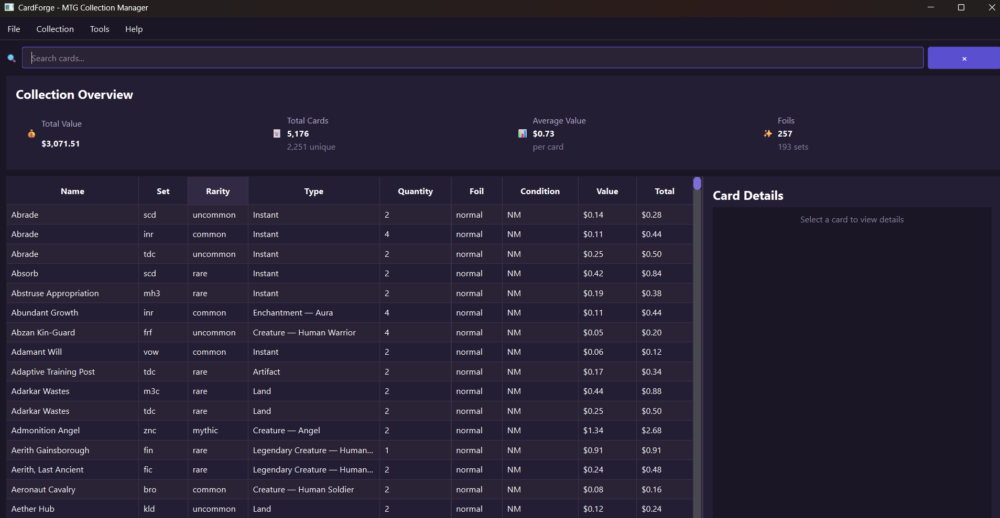
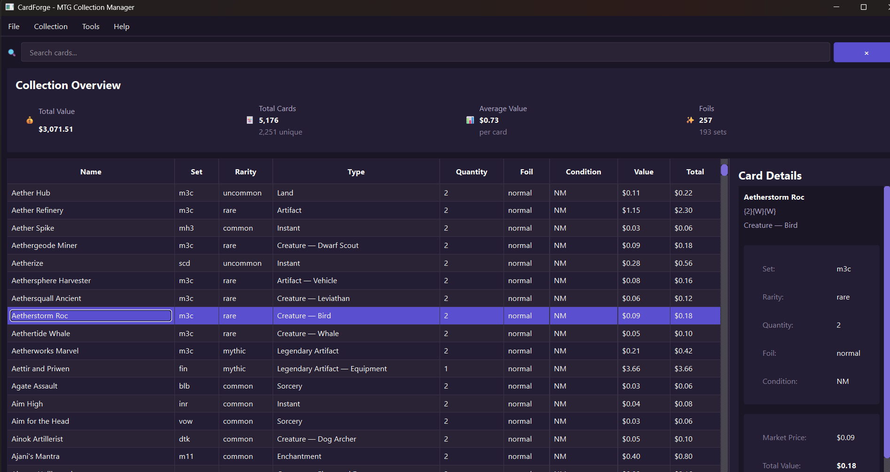
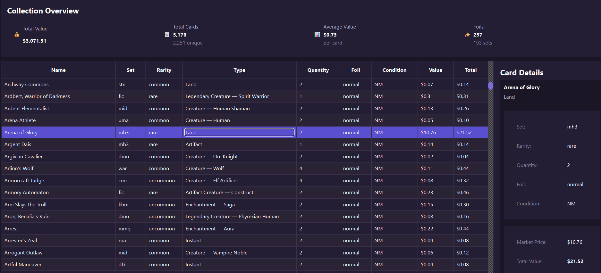

<div align="center">

# ⚔️ CardForge

### **Professional Magic: The Gathering Collection Management Platform**

*A modern, async-first Python application for managing MTG card collections, building decks, tracking trades, and integrating with AI assistants via MCP. Available as CLI, GUI, and MCP server.*

[](https://python.org)
[](https://sqlite.org)
[](https://pydantic.dev)
[](LICENSE)

[](https://github.com/psf/black)
[](http://mypy-lang.org/)
[](https://docs.python.org/3/library/asyncio.html)

---

[Features](#-features) •
[Quick Start](#-quick-start) •
[CLI & GUI](#-cli--gui) •
[MCP Integration](#-mcp-integration) •
[Architecture](#-architecture) •
[Documentation](#-documentation)

</div>

---

## ✨ Features

<table>
<tr>
<td width="50%">

### 📦 Collection Management

- Import from **Moxfield**, **ManaBox**, CSV
- Track quantities, conditions, foils
- Real-time collection valuation
- Duplicate detection & trade suggestions

</td>
<td width="50%">

### 🎴 Deck Building

- Create **Commander**, Standard, Modern decks
- Track missing cards with buy lists
- Budget-aware deck planning
- Category organization (creatures, removal, etc.)

</td>
</tr>
<tr>
<td width="50%">

### 💰 Price Intelligence

- Live pricing via **Scryfall API**
- Price history tracking
- Compare printings across sets
- Budget alerts and watchlists

</td>
<td width="50%">

### 🔍 Smart Search

- **Full-text search** with FTS5
- Filter by color, type, CMC, price
- Oracle text search
- EDHREC rank sorting

</td>
</tr>
<tr>
<td width="50%">

### 📊 Analytics

- Collection value breakdown
- Set completion tracking
- Investment performance
- Rarity distribution

</td>
<td width="50%">

### 🤖 AI Integration

- **Claude Desktop** via MCP
- Natural language deck building
- Smart card suggestions
- Automated buy list generation

</td>
</tr>
</table>

---

## 📸 Screenshots

<div align="center">

### PyQt6 Professional GUI

<table>
<tr>
<td align="center">

<br><em>Main Window - Collection browser with analytics dashboard</em>
</td>
</tr>
<tr>
<td align="center">

<br><em>Collection Table - Sortable columns, alternating rows, real-time search</em>
</td>
</tr>
<tr>
<td align="center">

<br><em>Card Details - Full card info, pricing, and collection metadata</em>
</td>
</tr>
</table>

</div>

---

## 🚀 Quick Start

### Prerequisites

- Python 3.11 or higher
- pip package manager

### Installation

```bash
# Clone the repository
git clone https://github.com/StrayDogSyn/MyManaBox.git
cd MyManaBox

# Create virtual environment
python -m venv .venv
.venv\Scripts\activate  # Windows
# source .venv/bin/activate  # macOS/Linux

# Install dependencies
pip install -r requirements.txt

# Initialize the database
python -m cardforge.cli.main db init

# Launch the GUI (optional)
python run_gui.py
```

### Import Your Collection

```bash
# Import from Moxfield CSV export
python -m cardforge.cli.main collection import "path/to/moxfield_export.csv"

# View your collection stats
python -m cardforge.cli.main collection stats
```

<details>
<summary>📋 <strong>Example Output</strong></summary>

```text
╭─────────────────── Collection Statistics ───────────────────╮
│                                                             │
│   📊 Overview                                               │
│   ├── Unique Cards:     1,769                               │
│   ├── Total Cards:      2,222                               │
│   ├── Foils:            127                                 │
│   └── Sets:             89                                  │
│                                                             │
│   💰 Value                                                  │
│   └── Estimated Total:  $1,284.96                           │
│                                                             │
╰─────────────────────────────────────────────────────────────╯
```

</details>

---

## 💻 CLI & GUI

CardForge provides both a comprehensive CLI and a modern GUI.

### Graphical Interfaces

CardForge provides **two** professional GUI options:

#### PyQt6 GUI (Recommended - Professional Desktop App)

```bash
python run_qt_gui.py
```

**Features:**

- 🖥️ **Native look and feel** - True desktop app experience
- ⚡ **High performance** - Optimized Qt rendering
- 🎨 **Full QSS theming** - CSS-like customization
- 🔄 **Built-in threading** - Smooth async operations

See the [PyQt6 GUI Guide](docs/PYQT6_GUI_GUIDE.md) for details.

#### Tkinter GUI (Lightweight Alternative)

```bash
python run_gui.py
```

**Features:**

- 📊 Real-time collection dashboard
- 🔍 Advanced search and filtering
- 🎴 Card detail views
- 💰 Price tracking

See the [Tkinter GUI Guide](docs/GUI_GUIDE.md) for details.

### Command-Line Interface

For power users and automation, use the comprehensive CLI:

### Collection Commands

| Command | Description |
|---------|-------------|
| `collection stats` | Display collection statistics and value |
| `collection search <query>` | Search cards in your collection |
| `collection import <csv>` | Import from CSV (Moxfield/ManaBox) |
| `collection export <path>` | Export collection to CSV/JSON |
| `collection duplicates` | Find duplicate cards for trading |

### Card Commands

| Command | Description |
|---------|-------------|
| `card search <query>` | Search all cards in database |
| `card lookup <name>` | Get detailed card information |

### Deck Commands

| Command | Description |
|---------|-------------|
| `deck create <name>` | Create a new deck |
| `deck list` | List all your decks |
| `deck add-card <deck> <card>` | Add a card to a deck |
| `deck missing <id>` | Show cards you need |
| `deck buy-list <deck>` | Generate prioritized buy list |

### Buy List Commands

| Command | Description |
|---------|-------------|
| `buylist show` | Display current buy list |
| `buylist add <card>` | Add card to buy list |

<details>
<summary>📖 <strong>Full Command Examples</strong></summary>

```bash
# Search for angels under $5
python -m cardforge.cli.main card search "angel" --type creature --color W

# Create a Commander deck
python -m cardforge.cli.main deck create "Kaalia Voltron" \
    --format commander \
    --commander "Kaalia of the Vast"

# Generate buy list with budget
python -m cardforge.cli.main deck buy-list "Kaalia Voltron" --budget 50

# Find valuable duplicates
python -m cardforge.cli.main collection duplicates --min-value 2.00
```

</details>

---

## 🤖 MCP Integration

CardForge includes a **Model Context Protocol (MCP)** server for seamless integration with Claude Desktop, enabling AI-assisted deck building and collection management.

### Setup

Add to your Claude Desktop configuration:

**Windows:** `%APPDATA%\Claude\claude_desktop_config.json`

```json
{
  "mcpServers": {
    "cardforge": {
      "command": "python",
      "args": ["-m", "cardforge.mcp.server"],
      "cwd": "C:/path/to/MyManaBox"
    }
  }
}
```

### Available Tools

| Tool | Description |
|------|-------------|
| `search_cards` | Search cards with filters |
| `check_ownership` | Check if you own specific cards |
| `get_collection_stats` | Get collection overview |
| `get_deck_missing_cards` | Find cards needed for a deck |
| `add_to_buy_list` | Add cards to buy list |
| `suggest_deck_upgrades` | AI-powered upgrade suggestions |
| `find_duplicates` | Find tradeable duplicates |
| `compare_printings` | Compare prices across sets |

### Example Conversation

> **You:** I want to build a Kaalia deck. What angels, demons, and dragons do I own?
>
> **Claude:** Based on your collection, you own 12 angels including Aurelia and Gisela, 8 demons including Rune-Scarred Demon, and 6 dragons including Balefire Dragon...
>
> **You:** Add the missing staples to my buy list under $100
>
> **Claude:** Added 8 cards to your buy list totaling $87.50...

---

## 🏗 Architecture

CardForge follows clean architecture principles with clear separation of concerns:

```text
┌─────────────────────────────────────────────────────────────┐
│                    Presentation Layer                        │
│         CLI (Click + Rich)  │  MCP Server (Claude)          │
├─────────────────────────────────────────────────────────────┤
│                      Service Layer                           │
│   CardService │ CollectionService │ DeckService │ Trade     │
├─────────────────────────────────────────────────────────────┤
│                    Repository Layer                          │
│         Async Data Access with Full-Text Search             │
├─────────────────────────────────────────────────────────────┤
│                       Data Layer                             │
│         SQLite (FTS5)  │  Scryfall API  │  TCGPlayer        │
└─────────────────────────────────────────────────────────────┘
```

### Project Structure

```text
cardforge/
├── 📁 api/           # External API clients
├── 📁 cli/           # Command-line interface
├── 📁 config/        # Configuration management
├── 📁 database/      # SQLite schema & migrations
├── 📁 models/        # Pydantic data models
├── 📁 repositories/  # Data access layer
├── 📁 services/      # Business logic
├── 📁 mcp/           # Claude Desktop integration
└── 📁 tests/         # Test suite
```

---

## 🛠 Technology Stack

<table>
<tr>
<td align="center" width="120">

<br><strong>Python 3.11+</strong>
<br><sub>Async/Await</sub>
</td>
<td align="center" width="120">

<br><strong>SQLite</strong>
<br><sub>FTS5 Search</sub>
</td>
<td align="center" width="120">

<br><strong>Pydantic v2</strong>
<br><sub>Validation</sub>
</td>
<td align="center" width="120">

<br><strong>Click</strong>
<br><sub>CLI Framework</sub>
</td>
<td align="center" width="120">

<br><strong>Rich</strong>
<br><sub>Terminal UI</sub>
</td>
</tr>
</table>

### Key Dependencies

| Package | Purpose |
|---------|---------|
| `aiosqlite` | Async SQLite database access |
| `httpx` / `aiohttp` | Async HTTP clients |
| `pydantic` | Data validation & serialization |
| `click` | CLI command framework |
| `rich` | Beautiful terminal formatting |
| `mcp` | Model Context Protocol server |

---

## 📚 Documentation

| Document | Description |
|----------|-------------|
| [API Reference](docs/API.md) | Full CLI and Python API documentation |
| [PyQt6 GUI Guide](docs/PYQT6_GUI_GUIDE.md) | Professional PyQt6 desktop interface |
| [Tkinter GUI Guide](docs/GUI_GUIDE.md) | Lightweight Tkinter interface |
| [Architecture](docs/ARCHITECTURE.md) | System design and patterns |
| [MCP Integration](docs/MCP_INTEGRATION.md) | Claude Desktop setup guide |

---

## 🧪 Development

```bash
# Run tests
python -m pytest cardforge/tests/ -v

# Type checking
python -m mypy cardforge/

# Format code
python -m black cardforge/

# Lint
python -m ruff check cardforge/
```

---

## 🗺 Roadmap

- [x] **Tkinter GUI** - Lightweight desktop interface
- [x] **PyQt6 GUI** - Professional desktop application ✨ NEW
- [ ] **Web Interface** - React-based dashboard
- [ ] **Price Alerts** - Notifications for price changes
- [ ] **Deck Sharing** - Export/import deck lists
- [ ] **Collection Sync** - Cloud backup & sync
- [ ] **Mobile App** - React Native companion
- [ ] **Trade Finder** - Match with other collectors

---

## 🤝 Contributing

Contributions are welcome! Please feel free to submit a Pull Request.

1. Fork the repository
2. Create your feature branch (`git checkout -b feature/AmazingFeature`)
3. Commit your changes (`git commit -m 'Add some AmazingFeature'`)
4. Push to the branch (`git push origin feature/AmazingFeature`)
5. Open a Pull Request

---

## 📄 License

This project is licensed under the MIT License - see the [LICENSE](LICENSE) file for details.

---

<div align="center">

**Built with ❤️ for the Magic: The Gathering community**

[](https://github.com/StrayDogSyn/MyManaBox)

*Magic: The Gathering is © Wizards of the Coast. CardForge is not affiliated with or endorsed by Wizards of the Coast.*

</div>
