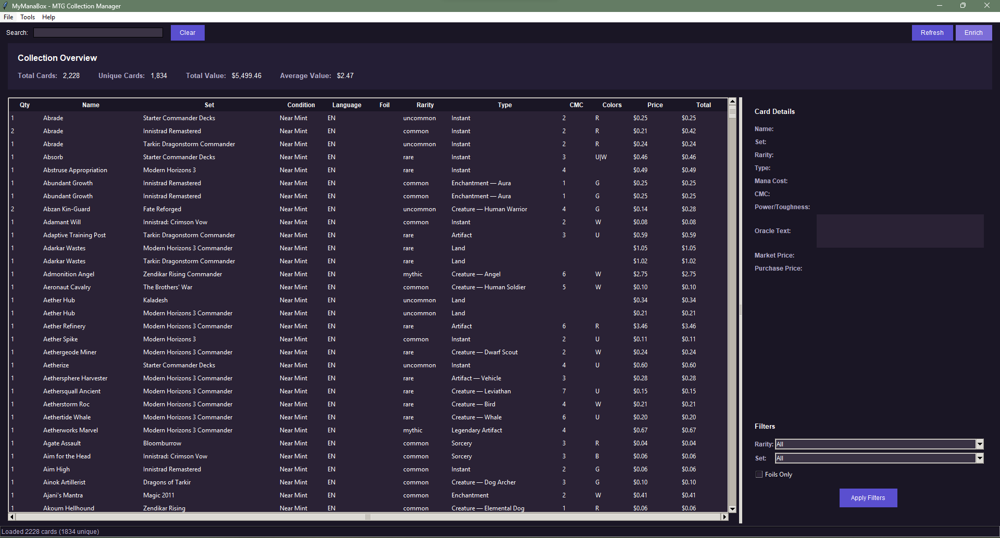

# MyManaBox - Magic: The Gathering Collection Manager

A comprehensive Python tool for managing and organizing Magic: The Gathering card collections with advanced pricing analytics, automation, and modern GUI.


*Modern GUI interface showing collection overview, card table with pricing data, and detailed card information panels*

## ✨ Features

### Core Features
- **Collection Management**: Import and manage MTG card collections from various sources
- **Advanced Pricing**: Market-accurate pricing with TCGPlayer-style logic and aggressive premium multipliers
- **Smart Analytics**: Comprehensive average pricing analysis by rarity, set, condition, and price tiers
- **Modern GUI**: Dark theme interface with enhanced statistics and filtering capabilities
- **Search & Filter**: Advanced search capabilities across your collection
- **Foil Premium Tracking**: Automatic foil detection and premium calculation (5.40x multiplier)
- **Price Coverage**: 100% USD and foil price coverage with purchase price optimization
- **Cache System**: Efficient card data caching with Scryfall API integration

### 🚀 Enhanced Features (New!)
- **Automated Enrichment**: Schedule daily price updates via Windows Task Scheduler
- **Mobile ManaBox Import**: Smart format detection and merging from mobile app exports
- **Multi-Platform Export**: Export to Moxfield, Archidekt, TappedOut, MTG Goldfish, Deckbox
- **Automation Setup**: One-command Task Scheduler integration
- **Setup Verification**: Health checks for dependencies and configuration

## Key Analytics

- **Collection Overview**: Total value ($4,789.48), averages, medians, and price ranges
- **Rarity Analysis**: Pricing breakdown by mythic, rare, uncommon, and common cards
- **Price Tiers**: Distribution from bulk ($0-1) to ultra-high value ($100+) cards
- **Set Analysis**: Average pricing across 186+ Magic sets
- **Duplicate Detection**: Identify 157+ cards with multiple copies for trading
- **Market Insights**: Price distribution analysis and collection optimization tips

## Quick Start

### Installation

1. Clone the repository:

```bash
git clone <your-repo-url>
cd MyManaBox
```

1. Create and activate a virtual environment:

```bash
python -m venv .venv
.venv\Scripts\activate  # Windows
# source .venv/bin/activate  # Linux/Mac
```

1. Install dependencies:

```bash
pip install -r requirements.txt
```

### Basic Usage

```bash
# View collection summary
python main.py --summary

# Search for specific cards
python main.py --search "Lightning Bolt"

# Sort collection by color
python main.py --sort color

# Generate collection analytics
python main.py --analytics
```

### 🚀 Enhanced Usage (New!)

```bash
# Verify setup
python scripts/verify_setup.py

# Auto-enrich with current prices
python scripts/auto_enrich.py --backup

# Import from mobile ManaBox
python scripts/import_mobile.py ~/Downloads/manabox_export.csv --merge

# Export to Moxfield
python scripts/export_collection.py --format moxfield

# Setup automation
python scripts/setup_automation.py
```

## 📚 Documentation

- **[GET_STARTED_NOW.md](GET_STARTED_NOW.md)** ⭐ Start here!
- **[docs/ENHANCED_FEATURES.md](docs/ENHANCED_FEATURES.md)** - Detailed feature guide
- **[docs/QUICK_START.md](docs/QUICK_START.md)** - Complete command reference
- **[docs/USAGE.md](docs/USAGE.md)** - Detailed usage instructions
- **[docs/PROJECT_STRUCTURE.md](docs/PROJECT_STRUCTURE.md)** - Code organization
- **[REPOSITORY_STRUCTURE.md](REPOSITORY_STRUCTURE.md)** - Folder organization

## Project Structure

```text
MyManaBox/
├── src/                    # Main source code
│   ├── models/            # Data models (Card, Collection, etc.)
│   ├── data/              # Data access layer (CSV, API, file management)
│   ├── services/          # Business logic (sorting, search, analytics)
│   ├── presentation/      # User interface (CLI, formatters)
│   └── utils/             # Utilities and constants
├── data/                  # Collection data files
├── docs/                  # Documentation
├── scripts/               # 🆕 Automation & enhancement scripts
│   ├── auto_enrich.py    # 🆕 Automated price updates
│   ├── import_mobile.py  # 🆕 Mobile ManaBox import
│   ├── export_collection.py # 🆕 Multi-platform export
│   ├── setup_automation.py # 🆕 Task Scheduler setup
│   └── verify_setup.py   # 🆕 Setup verification
├── legacy/                # Legacy scripts (for reference)
├── tests/                 # Test files
├── gui.py                 # Modern GUI application
├── main.py                # Command-line interface
└── run_gui.py             # GUI launcher
```

## 🔄 Complete Workflows

### Daily Automation
```bash
# Setup once
python scripts/setup_automation.py
# Collection auto-updates daily! ✨
```

### Mobile Scanning
```bash
# 1. Scan in mobile ManaBox
# 2. Export & transfer CSV
# 3. Import and enrich
python scripts/import_mobile.py manabox_export.csv --merge
python scripts/auto_enrich.py --backup
```

### Multi-Platform Export
```bash
# Export to all platforms at once
python scripts/export_collection.py --all
```

The `scripts/` directory contains the following essential tools:

- **`average_pricing.py`** - Comprehensive pricing analysis and statistics
- **`enrich_collection.py`** - Enrich collection with Scryfall API data
- **`price_analysis.py`** - Analyze pricing gaps and coverage
- **`comprehensive_price_update.py`** - Complete price update system
- **`advanced_price_enhancement.py`** - Advanced TCGPlayer-style pricing

Most scripts are integrated into the GUI for easy access.

## Documentation

- [Usage Guide](docs/USAGE.md) - Detailed usage instructions
- [Import Instructions](docs/IMPORT_INSTRUCTIONS.md) - How to import collections
- [Refactoring Summary](docs/REFACTORING_SUMMARY.md) - Technical details about the codebase

## Requirements

- Python 3.8+
- pandas
- requests
- colorama
- tabulate
- python-mtgsdk

## Contributing

1. Fork the repository
2. Create a feature branch
3. Make your changes
4. Add tests if applicable
5. Submit a pull request

## License



See [LICENSE](LICENSE) file for details.

## Legacy Support

The `legacy/` directory contains the original scripts for backward compatibility:

- `card_sorter.py` - Original sorting functionality
- `enhanced_sorter.py` - Enhanced version with additional features
- `mymanabox.py` - Alternative interface
- `scryfall_api.py` - Original API integration

These can still be used independently if needed.
